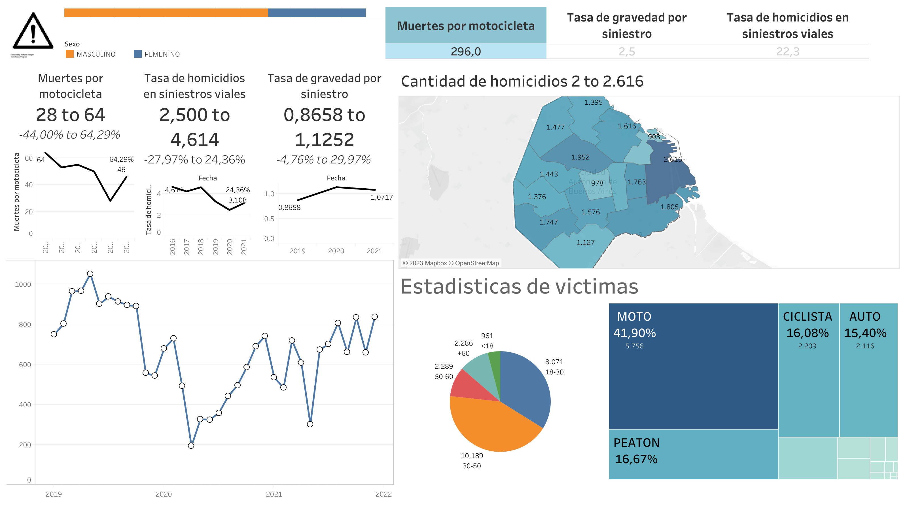

# README

---

# Informacion del repositorio

## Contenido

El repositorio posee los siguientes archivos

- `requirements.txt` archivo txt con las dependencias utilizadas en el notebook de python
- [`Dashboard .twbx`](https://github.com/lautaroppaniagua/PI_DA/blob/main/Dashboard%20.twbx) archivo tableau con el dashboard
- [`EDA.ipynb`](https://github.com/lautaroppaniagua/PI_DA/blob/main/EDA.ipynb) notebook de python con el analisis exploratorio de datos
- [`EDA.pdf`](https://github.com/lautaroppaniagua/PI_DA/blob/main/EDA.pdf) notebook de analisis exploratorio de datos en formato pdf para facilitar su lectura
- [`datasets`](https://github.com/lautaroppaniagua/PI_DA/tree/main/datasets) carpeta con los archivos de informacion usados para el trabajo descritos a continuacion
    - **[`camaras_fijas_control_vehicular.csv`](https://github.com/lautaroppaniagua/PI_DA/blob/main/datasets/camaras_fijas_control_vehicular.csv)** datos y coordenadas de camaras para control vehicular
    - **[`semaforos.csv`](https://github.com/lautaroppaniagua/PI_DA/blob/main/datasets/semaforos.csv)** datos y coordenadas de semaforos
    - **[`sensores.csv`](https://github.com/lautaroppaniagua/PI_DA/blob/main/datasets/sensores.csv)** datos y coordenadas de sensores de trafico
    - **[`comunas.geojson`](https://github.com/lautaroppaniagua/PI_DA/blob/main/datasets/comunas.geojson)** archivo espacial de tipo geojson para graficar las distintas comunas dentro del dashboard
    - **[`combined_data.csv`](https://github.com/lautaroppaniagua/PI_DA/blob/main/datasets/combined_data.csv)** archivo con datos procesados y unificados de los dataframes iniciales
    - **[`combined_victims_data.csv`](https://github.com/lautaroppaniagua/PI_DA/blob/main/datasets/combined_victims_data.csv)** la segunda parte de los datos procesados y unificados de los dataframes de victimas iniciales
    - **[`excel`](https://github.com/lautaroppaniagua/PI_DA/tree/main/datasets/excel)** carpeta contenedora de los dataframes originales
        - **[`homicidios.xlsx`](https://github.com/lautaroppaniagua/PI_DA/blob/main/datasets/excel/homicidios.xlsx)** dataframe de siniestros de tipo homicidio con sus correspondientes paginas en formato excel
        - [`lesiones.xlsx`](https://github.com/lautaroppaniagua/PI_DA/blob/main/datasets/excel/lesiones.xlsx) dataframe de siniestros terminados en lesiones con sus correspondientes paginas en formato excel

## Instrucciones de instalacion

```python
pip3 install -r requirements.txt
```

Una vez realizada la instalacion puede correr el EDA tranquilamente.

---

# Descripcion de dashboard

El dashboard de tableau nos permite visualizar comodamente estdisticas generales de nuestras fuentes de datos. A continuacion daremos un breve repaso por cada elemento en el



### Distribucion sexo

Nos muestra la distribucion de victimas de siniestros segun su sexo


### KPIs

Muestra sencillamente el ultimo valor de los 3 KPIS presentados

- Muertes por motocicleta: cantidad de accidentes mortales de motocicleta
- Tasa de gravedad por siniestro: Cantidad de accidentes que terminan con lesiones graves entre todos los siniestros registrados
- Tasa de homicidios viales: Numeros de victimas fatales en accidentes de transito por cada 100 mil habitantes


### Desempeño de KPIs a lo largo del año

De igual manera, muestra los KPIs nombrados arriba, pero acompañados de un grafico que nos muestra los cambios de este a lo largo de los años y su cambio porcentual


### Mapa de siniestros por comuna

Un mapa con sus separaciones por comuna y la cantidad de siniestros que hay en cada una de estas, a su vez tambien nos permite filtrar si quisiesemos observar los datos de una comuna especifica.


### Grafico de accidentes por mes y año

Un grafico de lineas que nos muestra el comportamiento y la cantidad de siniestros a lo largo de cada mes en los distintos años que se posee datos.


### Grafico de rango etario

Graficamos los rangos etarios mas propensos a ser victimas de siniestros y a su vez nos permite filtrar por cada uno de estos.


### Treemap vehiculos victimas

Por medio de un mapeo de arboles podemos ver los vehiculos mas propensos a ser victimas de accidentes automovilisticos y tambien filtrar por ellos.


---

# Analisis y conclusiones del proyecto

En este proyecto se analizaron distintos casos de siniestros en la ciudad de C.A.B.A. en Argentina, luego de realizar un analisis de la distribucion de los datos pudimos graficar y observar varios comportamientos en el transito vehicular del lugar. 

Comenzamos realizando un analisis de datos duplicados y nulos como se puede observar en el notebook, continuamos buscando outliers y una vez que pasamos esta etapa de analisis de datos y su presentacion comenzamos a realizar graficos que nos permitan desarrollar distintas conjeturas con la informacion brindada.

## Distribucion de siniestros

A continuacion mostraremos los graficos pertinentes a su distribucion en distintas caracteristicas de los datasets.

### Anual


### Mensual


### Diario


### Horario


## Correlaciones dia y hora

### Lesiones


### Homicidios


### Por vehiculos involucrados


### Por tipo de vehiculo victima


### Por tipo de vehiculo acusado


## Distribucion en victimas

### Por genero


### Por rango etario


### Probabilidad de mortalidad por rango etario


### Probabilidad de lesion grave por rango etario


## Mapas

### Mapas de siniestros por comuna


### Mapas de siniestros por gravedad (muerte o lesion)


### Mapa de calor por siniestros


### Mapa de controles vehiculares


### Mapa de calor de controles vehiculares


# Conclusiones

### Los roles de los distintos vehiculos

Dentro de los analisis pudimos observar que el [vehiculo mas propenso a cumplir el rol de victima](https://www.notion.so/README-1c8aa72e6ba04ae4b0024de9eb10b273?pvs=21) son las motocicletas que lideran el puesto de victimas tanto en siniestros con lesiones como aquellos que terminan en una defuncion. Por otro lado, los [vehiculos mas acusados de ser culpables en los accidentes](https://www.notion.so/README-1c8aa72e6ba04ae4b0024de9eb10b273?pvs=21) suelen ser aquellos de grandes tamaño como camiones, camionetas, transportes publicos o automoviles. Por lo que podemos concluir que una de las causas de siniestros podria ser la imprudencia de conductores que poseen mejores medidas de seguridad que otros mas indefensos como lo son las victimas mas propensas (motos, peatones, bicicletas).

### Horarios de mayor frecuencia

Observando las graficas de correlacion entre dias y horarios de todos los accidentes, podemos observar que se diferencian 2 rangos temporales de mayor frecuencia en siniestros. La primera en [siniestros que terminan en lesiones](https://www.notion.so/README-1c8aa72e6ba04ae4b0024de9eb10b273?pvs=21) la podemos ver en dias de semana y en horarios de tarde, lo que podria darnos indicios que son producto del alto transito en horarios pico de la ciudad siendo los horarios mas comunes en los que las personas salen de sus obligaciones. Por otro lado vemos que los [homicidios se producen con mayor frecuencia](https://www.notion.so/README-1c8aa72e6ba04ae4b0024de9eb10b273?pvs=21) en fines de semana y a altos horarios de la madrugada, por lo que podemos suponer que se deben a irresponsabilidades en los conductores que podrian ser causados por fiestas o excesos y acarrea como consecuencia imprudencias y conducciones temerarias con finales tragicos como siniestros como victimas de homicidios.

### Consecuencias por rango etario

Con las visualizaciones de los datos de las victimas pudimos llegar a la conclusion de que los adultos mayores, con una edad ubicada arriba de los 60  años es la parte de la [poblacion que menos posibilidades tiene de superar un siniestro](https://www.notion.so/README-1c8aa72e6ba04ae4b0024de9eb10b273?pvs=21), siendo que tienen alrededor de un 70% de chances de que estos terminen en una muerte, esto es producido dado que al estado avanzado de su cuerpo tiene menos tolerancia a los golpes y las lesiones posibles que un accidente automovilistico pueda causar.

### Controles vehiculares

Como pudimos observar con el [mapa de calor](https://www.notion.so/README-1c8aa72e6ba04ae4b0024de9eb10b273?pvs=21), hay una gran cantidad de controles vehiculares de distintos tipos (Sensores, camaras, semaforos) en las [zonas de mayor concentracion de siniestros](https://www.notion.so/README-1c8aa72e6ba04ae4b0024de9eb10b273?pvs=21)  pero a pesar de esto no significa que se reduzca la cantidad de accidentes de transito alli. Por lo que podemos concluir que los siniestros no son producto de la falta de controles sino que puede deberse a otras causas como podrian ser imprudencias al volante

---
